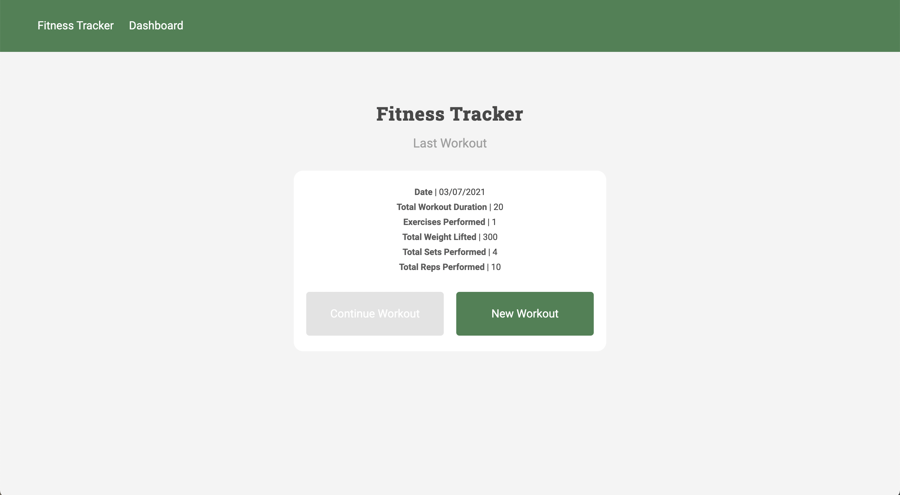
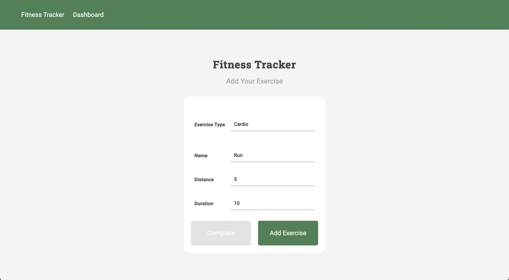
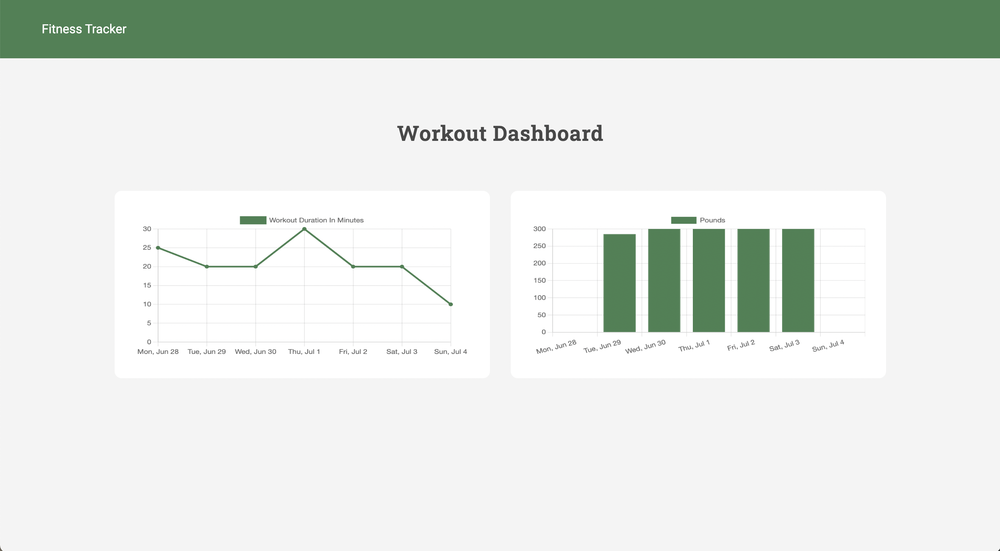

# Fitness-Tracker

A full stack fitness tracking application with the back-end supported by mongoDB | Deployed on Heroku

## Deployment

My Fitness Tracker has been deployed here:
[Fitness Tracker](#)

## Why make this?

I made this application to get a better grasp of full stack development. I was able to develop both the front end and back end code using mongoDB and express.

## My goal

I wanted the functionality to be as simple as possible. I strived to do my due diligence and error test my application throughout. I completed my code with a simple user interface, complemented by an easy to understand user experience.

## Landing Page

Here you can view the stats from your previous workout

## Adding Workout

Here you can decide to add cardio or resistance exercises to your workout

## Dashboard

These graphs will show you the total duration and total weight lifted from your **seven** most recent workouts.

## End note

I hope you enjoyed going through my full-stack application using mongoDB 👏
